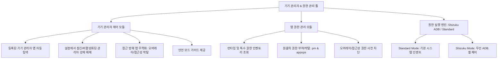

# 📱 Android Device Admin & Permission Manager - Master Development Plan

> **프로젝트 개요**: 안드로이드 14, 15, 16 환경에서 **루팅 없이(Non-Root)** 설정에서 비활성화(회색/잠김)된 앱 및 악성·고집 기기 관리자(Device Admin) 앱을 안전하고 강력하게 탐색, 관리, 강제 해제하고 세부 권한을 제어하는 종합 시스템 관리 도구 개발 계획서입니다.

---

## 1. 프로젝트 목표 및 범위 (Scope & Objectives)



### 1.1 핵심 목표
1. **완전한 순정(Non-Root) 폰 호환성**: 루팅 없이 Android 14 (API 34), Android 15 (API 35), Android 16 (API 36 호환) 완벽 지원.
2. **설정에서 비활성화(잠김)된 기기 관리자 해제**: 스마트폰 설정의 기기 관리자 화면에서 회색으로 비활성화되어 해제가 불가능한 앱(프로필 소유자, 정책 잠금 앱 등)을 Shizuku(무선 ADB)를 통해 강제 해제.
3. **접근 방해 앱 무력화**: 오버레이 창이나 접근성 서비스로 설정을 방해하는 앱을 프로세스 종료 및 권한 박탈 후 해제.
4. **직관적인 권한 제어**: 기기 관리자 앱의 위험 권한을 실시간으로 확인하고 수정.

---

## 2. 시스템 아키텍처 및 기술 스택

### 2.1 기술 스택
- **Language**: Kotlin 2.0+
- **UI Framework**: Jetpack Compose + Material 3 (Material You 동적 테마, Edge-to-Edge)
- **Architecture**: Clean Architecture + MVI/MVVM (Jetpack ViewModel, StateFlow)
- **Dependency Injection**: Dagger Hilt
- **Privileged Execution (Non-Root)**:
  - `rikka.shizuku:api:13.+` & `rikka.shizuku:provider:13.+` (무루팅 무선 ADB 권한 연동)
- **Target SDK**: Android 15 (API 35) / Compile SDK: Android 16 Preview (API 36 호환) / Min SDK: Android 14 (API 34)

---

## 3. 핵심 기능별 기술 구현 전략

### 3.1 설정에서 비활성화(회색/잠김)된 관리자 해제 전략
```
[해제 요청 발생]
       │
       ├─► [Shizuku 무선 ADB 연동 상태]
       │         │
       │         ├─► 1단계: 대상 앱 강제 종료 (`am force-stop <pkg>`)
       │         ├─► 2단계: 오버레이/접근성 권한 박탈 (`appops set`, `pm revoke`)
       │         ├─► 3단계: 프로필/디바이스 소유자 잠금 해제 (`dpm clear-profile-owner`, `dpm clear-device-owner`)
       │         ├─► 4단계: 다중 ADB 해제 명령 실행 (`dpm remove-active-admin`, `cmd device_policy remove-active-admin`)
       │         └─► 5단계: 성공 확인 및 UI 갱신
       │
       └─► [Standard Mode (Shizuku 미연동)]
                 │
                 └─► '안전 모드(Safe Mode)' 단계별 가이드 제공 또는 Shizuku 페어링 유도
```

---

## 4. 보안 및 안전장치 (Safety & Risk Management)

- **핵심 시스템 앱 보호**: `Google Find My Device`, `Samsung Find` 등 핵심 시스템 기기 관리자 해제 시 붉은색 경고 다이얼로그 및 2단계 확인 요구.
- **안전 모드 가이드**: ADB 사용이 어려운 일반 사용자를 위한 안전 모드 진입 및 삭제 가이드.
