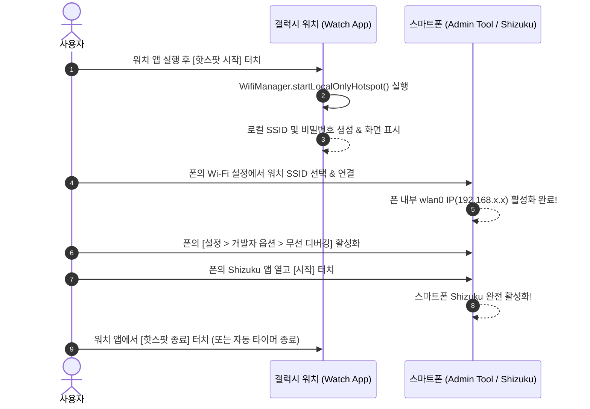

# ⌚ Galaxy Watch Shizuku Wi-Fi Bridge - Master Development Plan

> **프로젝트 개요**: 스마트폰에서 핫스팟을 켤 수 없고 주변에 Wi-Fi 공유기가 없는 상황에서도 스마트폰의 무선 디버깅(Shizuku)을 활성화할 수 있도록, 갤럭시 워치(Wear OS)에서 단독으로 로컬 Wi-Fi 핫스팟(SoftAP)을 생성하고 관리하는 전용 Wear OS 브릿지 도구 개발 계획서입니다.

---

## 1. 프로젝트 시스템 구조 및 작동 흐름



---

## 2. 주요 기능 및 컴포넌트 설계

### 2.1 핫스팟 엔진 (`WatchHotspotManager`)
- **API**: Android Framework `WifiManager.startLocalOnlyHotspot()`
- **동작 원리**:
  - 셀룰러 데이터(인터넷) 테더링이 아닌 **기기 간 순수 로컬 Wi-Fi SoftAP**를 생성하므로, 통신사 테더링 부가서비스 가입이나 요금제 제한 없이 순수 하드웨어 Wi-Fi 칩으로 작동.
  - 생성된 `LocalOnlyHotspotReservation` 객체에서 `SoftApConfiguration`을 읽어 워치 화면에 **SSID**와 **Pre-shared Key(비밀번호)**를 즉시 표출.
- **예외 처리 & 안전성**:
  - Wi-Fi 비활성화 시 자동 Wi-Fi 켜기 유도.
  - 워치 화면이 꺼져도 연결이 유지되도록 `WakeLock` 및 Foreground Service 지원.
  - 5분/10분 후 자동 핫스팟 종료 타이머를 적용하여 워치 배터리 보호.

### 2.2 Wear OS 전용 UI / UX 설계
- **Compose for Wear OS + Material 3**:
  - 원형 워치 화면(360x360 ~ 450x450 dp)에 최적화된 라운드 패딩 및 스크롤뷰.
  - 상단: 상태 인디케이터 (🟢 실행 중 / 🔴 중지됨).
  - 중앙: 거대한 원형 **[핫스팟 시작 / 중지]** 토글 버튼.
  - 하단 카드: 스마트폰 연결용 **Wi-Fi 이름 (SSID)** 및 **비밀번호**.
  - 설정: 화면 켜짐 유지 토글, 자동 종료 타이머 설정 (3분, 5분, 10분, 무제한).

---

## 3. 단계별 개발 로드맵 (Phased Roadmap)

| 단계 (Phase) | 목표 | 상세 작업 내용 | 산출물 |
|:---|:---|:---|:---|
| **Phase 1** | 워치 프로젝트 기반 구축 | • Wear OS 호환 Gradle 스크립트 작성 (`compileSdk = 35`)<br>• Compose for Wear OS, Horologist, Hilt 의존성 설정<br>• `AndroidManifest.xml` 필수 권한 선언 (`NEARBY_WIFI_DEVICES`, `CHANGE_WIFI_STATE` 등) | `gw_app/build.gradle.kts`<br>`AndroidManifest.xml` |
| **Phase 2** | 핫스팟 관리 엔진 개발 | • `WatchHotspotManager.kt` 로컬 핫스팟 시작/중지 로직 구현<br>• 핫스팟 상태 StateFlow 및 예외 처리 파이프라인 구축<br>• Foreground Service 및 WakeLock 배터리 최적화 구현 | `WatchHotspotManager.kt`<br>`HotspotForegroundService.kt` |
| **Phase 3** | Wear OS UI 구현 | • Compose for Wear OS 기반 메인 화면 (`WatchMainScreen.kt`)<br>• 원형 버튼, SSID/PW 안내 카드, 상태 칩 UI 컴포넌트<br>• `WatchBridgeViewModel.kt` 상태 관리 | `WatchMainScreen.kt`<br>`WatchBridgeViewModel.kt` |
| **Phase 4** | 빌드 & 실기기 검증 | • 릴리즈 APK 빌드 (`gw_app/app-release.apk`)<br>• 갤럭시 워치 무선 ADB 연결 및 설치 테스트<br>• 폰 연결 및 폰 Shizuku 작동 검증 | `gw_app/app-release.apk`<br>`README.md` |

---

## 4. 권한 및 보안 매니페스트 사양

```xml
<!-- Wi-Fi 제어 및 로컬 핫스팟 생성 권한 -->
<uses-permission android:name="android.permission.ACCESS_FINE_LOCATION" />
<uses-permission android:name="android.permission.ACCESS_WIFI_STATE" />
<uses-permission android:name="android.permission.CHANGE_WIFI_STATE" />
<uses-permission android:name="android.permission.NEARBY_WIFI_DEVICES" />
<uses-permission android:name="android.permission.WAKE_LOCK" />
<uses-permission android:name="android.permission.FOREGROUND_SERVICE" />
<uses-permission android:name="android.permission.FOREGROUND_SERVICE_CONNECTED_DEVICE" />

<!-- Wear OS 하드웨어 특성 선언 -->
<uses-feature android:name="android.hardware.type.watch" />
<uses-feature android:name="android.hardware.wifi" android:required="true" />
```
